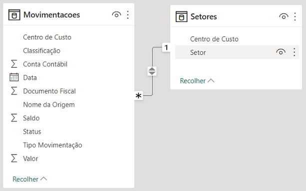
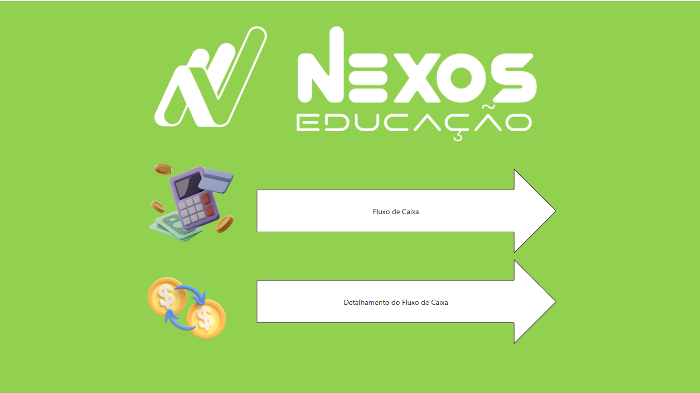
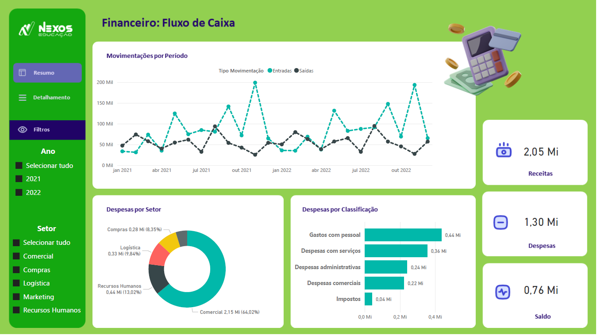
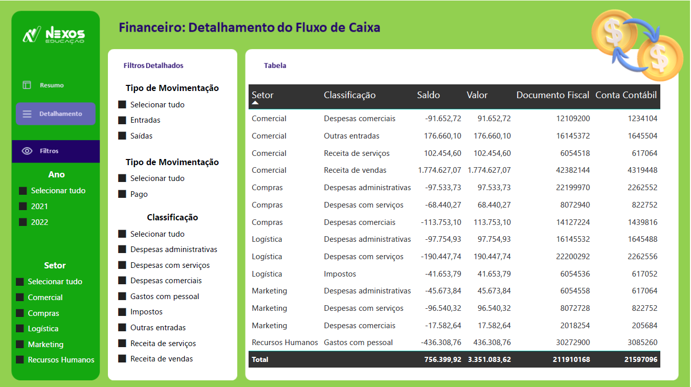

# Nexos Educação - Imersao PowerBI - Dashboard Financeiro
Dashboard 1 da Imersão PowerBI pela Nexos Educação com Karine Lago e Leticia Smirelli em Setembro de 2023.

## Arquivos e Pastas
- `Planos de Fundo` é pasta que contém as imagens de fundos das páginas do arquivo do Power BI.
- `Printscreens` é pasta que contém as imagens da execução do arquivo do Power BI.
- `Dashboard-1-Financeiro.pbix` é o arquivo do Power BI.
- `Dashboard-1-Financeiro.pdf` é o arquivo do Power BI exportado para pdf.

## Dados
Os dados forma fornecidos pela Nexos Educação e não se encontram neste diretório.

A coluna chave do relacionamento foi "Centro de Custo" que foi processada para que tivesse correspondência nas 2 tabelas.
O seu tipo foi convertido para texto e o prefixo "CC " foi retirado em uma das tabelas.

## Dashboard

