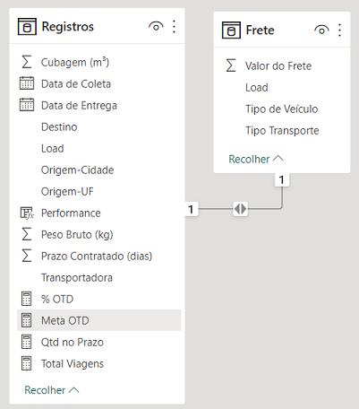
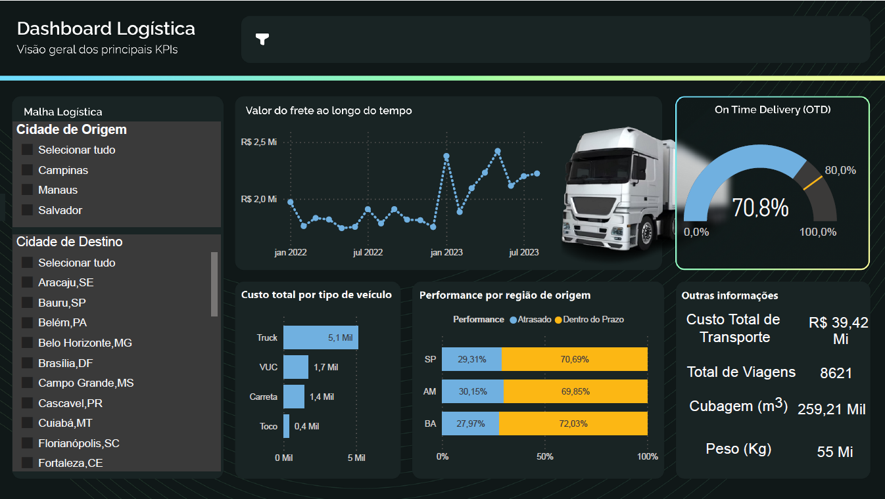

# Nexos Educacao - Imersao PowerBI - Dashboard Logística
Dashboard 2 da Imersão PowerBI pela Nexos Educação com Karine Lago e Leticia Smirelli em Setembro de 2023.


## Arquivos e Pastas
- `Plano-deFundo` é a pasta que contém a imagem de fundo do arquivo do Power BI.
- `Printscreens` é a pasta que contém a imagem da execução do arquivo do Power BI.
- `Dashboard-2-Logistica.pbix` é o arquivo do Power BI.
- `Dashboard-2-Logistica.pdf` é o arquivo do Power BI exportado para pdf.


## Dados
Os dados forma fornecidos pela Nexos Educação e não se encontram neste diretório.

Algumas métricas e colunas foram criadas via código:
```
Performance = 
IF(
    DATEDIFF([Data de Coleta], [Data de Entrega], DAY) > [Prazo Contratado (dias)],
    "Atrasado",
    "Dentro do Prazo"
)

Total Viagens = COUNTROWS('Registros')

Qtd no Prazo = CALCULATE([Total Viagens], 'Registros'[Performance] = "Dentro do Prazo")

% OTD = DIVIDE([Qtd no Prazo], [Total Viagens])

Meta OTD = 0.80
```




## Dashboard


