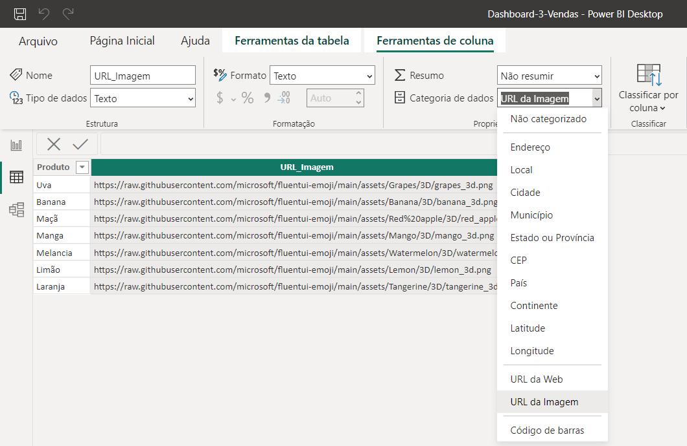
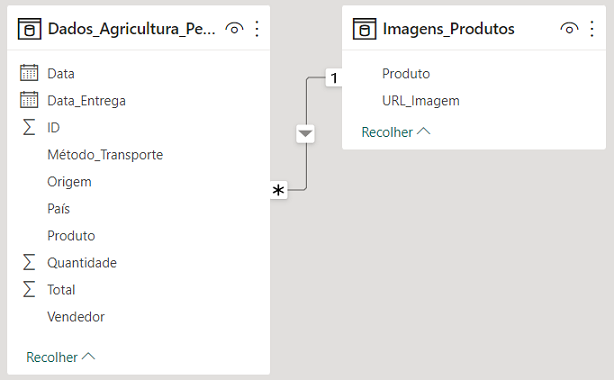
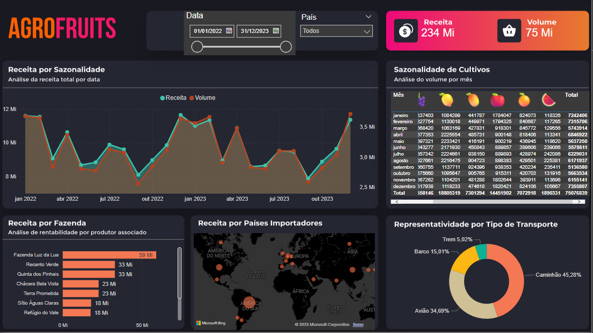

# Nexos Educação - Imersão PowerBI - Dashboard Vendas
Dashboard 3 da Imersão PowerBI pela Nexos Educação com Karine Lago e Leticia Smirelli em Setembro de 2023.

## Arquivos e Pastas
- `Plano-deFundo` é a pasta que contém a imagem de fundo do arquivo do Power BI.
- `Printscreens` é a pasta que contém as imagens da execução do arquivo do Power BI.
- `Dashboard-3-Vendas.pbix` é o arquivo do Power BI.
- `Dashboard-3-Vendas.pdf` é o arquivo do Power BI exportado para pdf.

## Dados
Os dados forma fornecidos pela Nexos Educação e não se encontram neste diretório.

Uma das tabelas carregadas possuia uma coluna com links de imagens que foram usadas como ícones de cabeçalho em uma Matriz.
Para isso, esta coluna foi formatada na aba "Exibição de Dados" como "Categoria de dados" definido como "URL da Imagem".

## Dashboard

